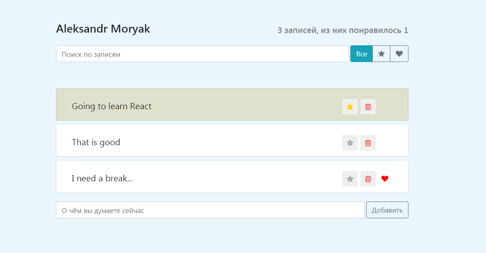

This project was bootstrapped with [Create React App](https://github.com/facebook/create-react-app).
<h3>
  It's a web application made by React where you can make a short posts, highlight, sort, like and search it.
</h3>

It's my first React project, as a part of training course where I was lern how to creat and implement the React componentets, to use a 'props' and 'state' to changed the componets dinamecly.

This project has the same function as the Twiter. You can put a short message, to search it by key words or even by single letters. Also you can like or highlight your messages and then to sort it by priority.

If you want to see how this app works you need to download this repository and run the app in the development mode.

In the project directory, you can run:

### `npm start`

Runs the app in the development mode.\
Open [http://localhost:3000](http://localhost:3000) to view it in the browser.

The page will reload if you make edits.\
You will also see any lint errors in the console.

## Learn More

You can learn more in the [Create React App documentation](https://facebook.github.io/create-react-app/docs/getting-started).

To learn React, check out the [React documentation](https://reactjs.org/).
